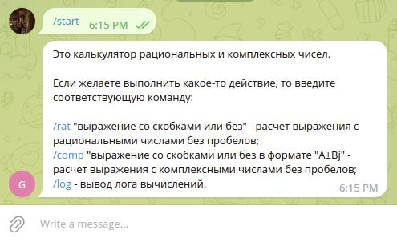
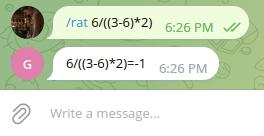
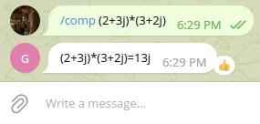
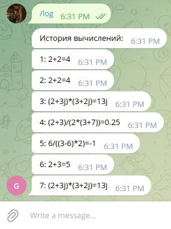

# **Программа для расчёта рациональных или комплексных чисел с возможностью сохранения лога**

## **Описание работы программы:**
Программа работает через бота в мессенджере Telegram с соответствующим токеном, который нужно вставить в поле API_TOKEN.
1. Запуск бота осуществляется через команду **/start**, после чего пользователю необходимо ввести команду, соответствующую её описанию:



2. При выборе, например, вычисления рациональных чисел, пользователю необходимо ввести команду **/rat** и через пробел выражение, которое он желает вычислить:


```
P.S.: При вводе неверных значений бот выдаст предупреждение.
```
3. При выборе, например, вычисления комплексных чисел, пользователю необходимо вввести команду **/comp** и через пробел выражение, которое он желает вычислить:



4. Программа может выводить лог, в котором хранятся ранее вычисленные пользователем выражения. Для этого необходимо ввести команду **/log**



```
P.S.: В случае с пустым журналом программа выдаст соответствующее предупреждение.
```

**Над приложением работал Кириллов Кирилл.**