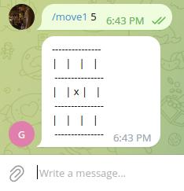

# **Игра "крестики-нолики" между игроками**

## **Описание работы программы:**
Программа работает через бота в мессенджере Telegram с соответствующим токеном, который нужно вставить в поле API_TOKEN.
1. Запуск бота осуществляется через команду **/start**, после чего пользователям выводится инструкция по игре, где при ходе необходимо вводить команду, соответствующую её описанию:


2. При ходе, например, первого игрока, пользователю необходимо ввести команду **/move1** и через пробел цифру, по которой он заполнит соответствующую клетку в игровом поле:


```
P.S.: При вводе неверных значений бот выдаст предупреждение.
```
3. Аналогично всё происходит при ходе второго игрока, только с командой **/move2**:


4. Игра продолжается до выигрыша одного из игроков, либо до тех пор, пока не возникнет ничейная ситуация:


**Над приложением работал Кириллов Кирилл.**